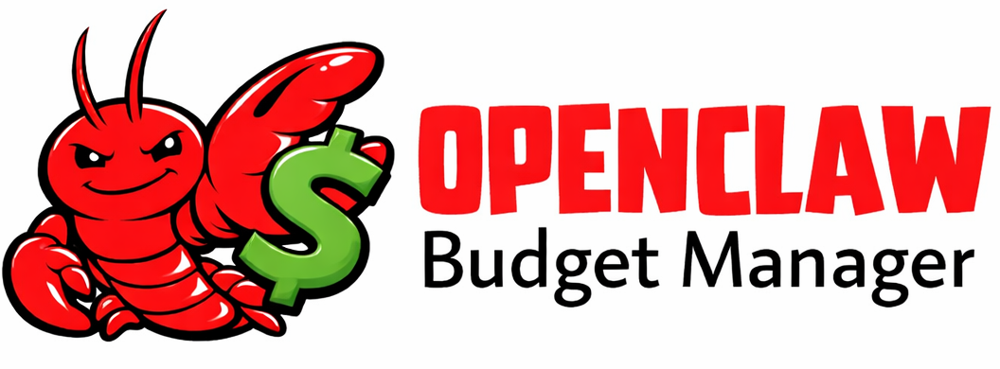

# OpenClaw Budget Manager

<p align="center">
  
</p>

An OpenClaw plugin that tracks daily API spend and **actively switches** to local Ollama models when the budget is exhausted. When the budget resets the next day, it restores the original cloud model automatically.

## How it works

### Cost tracking

After each API call (`agent_end` hook), the plugin:

1. Reads model, token counts, and pre-calculated cost from **all** assistant messages in the turn (including intermediate tool-use calls)
2. Sums costs across the entire turn and records a single transaction in `data/budget.json`
3. Falls back to a built-in cost-per-token table if messages don't include cost data

The budget resets automatically each day.

### Active model switching

When the budget runs out, the plugin **patches `~/.openclaw/openclaw.json`** to change the default model, then restarts the gateway:

1. **`agent_end` hook fires** — after tracking spend, the plugin checks the remaining budget
2. **Budget exhausted** — the plugin verifies Ollama is running and the target model is available
3. **Config write** — sets `agents.defaults.model.primary` to the Ollama model (e.g. `ollama/qwen3:8b`) and adds it to `agents.defaults.models`
4. **Gateway restart** — the plugin runs `openclaw gateway restart` to apply the model change
5. **Next day** — budget resets, plugin load detects state is "local" but budget is healthy, writes the original cloud model back to config and restarts the gateway

### Budget thresholds

- **> 20% remaining** — no intervention
- **< 20% remaining** — injects a prompt suggesting cheaper models (informational only)
- **$0 remaining** — actively switches to a local Ollama model via config write

### Restart loop prevention

A state file (`data/switcher-state.json`) tracks whether we've switched. On plugin load:

- State = "local" + budget exhausted → do nothing (already switched)
- State = "local" + budget healthy → restore cloud model
- No state / state = "cloud" → normal operation

## Prerequisites

- [OpenClaw](https://openclaw.ai) installed and configured
- [Ollama](https://ollama.com) installed and running (for local fallback models)
- Node.js 18+

### Recommended Ollama models (Qwen 3)

```bash
ollama pull qwen3:8b              # general fallback (~11-12GB RAM)
ollama pull qwen3-coder:30b       # coding tasks (~20-22GB RAM, MoE — only 3.3B active)
ollama pull qwen3-vl:8b           # vision tasks (~12-14GB RAM)
```

Ollama loads one model at a time, so these don't compete for RAM.

### Register Ollama as a provider in OpenClaw

OpenClaw needs to know about your Ollama instance. Add a `models.providers.ollama` section to `~/.openclaw/openclaw.json`:

```json
{
  "models": {
    "providers": {
      "ollama": {
        "baseUrl": "http://127.0.0.1:11434/v1",
        "apiKey": "ollama-local",
        "api": "openai-completions",
        "models": [
          {
            "id": "qwen3:8b",
            "name": "Qwen 3 8B",
            "reasoning": false,
            "input": ["text"],
            "cost": { "input": 0, "output": 0, "cacheRead": 0, "cacheWrite": 0 },
            "contextWindow": 32768,
            "maxTokens": 32768
          },
          {
            "id": "qwen3-coder:30b",
            "name": "Qwen 3 Coder 30B",
            "reasoning": false,
            "input": ["text"],
            "cost": { "input": 0, "output": 0, "cacheRead": 0, "cacheWrite": 0 },
            "contextWindow": 32768,
            "maxTokens": 32768
          },
          {
            "id": "qwen3-vl:8b",
            "name": "Qwen 3 VL 8B",
            "reasoning": false,
            "input": ["text", "image"],
            "cost": { "input": 0, "output": 0, "cacheRead": 0, "cacheWrite": 0 },
            "contextWindow": 32768,
            "maxTokens": 32768
          }
        ]
      }
    }
  }
}
```

Without this, OpenClaw will reject `ollama/*` model IDs with `Unknown model`. See the [Ollama provider docs](https://docs.openclaw.ai/providers/ollama) for more details.

## Smart local model selection

When the budget is exhausted, the plugin inspects the prompt and messages to pick the most appropriate local model:

| Task type | Default model | Trigger |
|---|---|---|
| Coding | `qwen3-coder:30b` | Prompt contains coding keywords or file extensions |
| Vision | `qwen3-vl:8b` | Any message contains an image content block |
| General | `qwen3:8b` | Everything else |

Priority order: **vision > coding > general**.

If the selected model is not available in Ollama, the plugin falls back to the general model. If that is also unavailable, no switch occurs.

### Overriding local models

Override via environment variables. Resolution order per task type:

1. Specific env var (`LOCAL_MODEL_GENERAL`, `LOCAL_MODEL_CODING`, `LOCAL_MODEL_VISION`)
2. `LOCAL_MODEL` (sets one model for all task types)
3. Built-in default

## Setup

### 1. Clone and install

```bash
git clone https://github.com/YOUR_USERNAME/OpenClawBudgetManager.git
cd OpenClawBudgetManager
npm install
```

### 2. Register the plugin with OpenClaw

Edit `~/.openclaw/openclaw.json` and add a `plugins` section (merge with your existing config):

```json
{
  "plugins": {
    "enabled": true,
    "load": {
      "paths": ["/absolute/path/to/OpenClawBudgetManager"]
    }
  }
}
```

### 3. Restart the OpenClaw gateway

```bash
openclaw gateway restart
```

### 4. Verify the plugin loaded

Check the gateway logs:

```bash
tail -f ~/.openclaw/logs/gateway.log
```

You should see:

```
[budget-manager] Plugin loaded. Daily budget: $5.00
```

After an API call:

```
[budget-manager] After tracking: $4.97 remaining (99%)
```

## Configuration

| Variable | Default | Description |
|---|---|---|
| `DAILY_BUDGET_USD` | `5.00` | Daily spend limit in USD |
| `BUDGET_DATA_DIR` | `./data` | Directory for runtime data files |
| `OLLAMA_URL` | `http://localhost:11434` | Ollama API base URL |
| `OPENCLAW_CONFIG` | `~/.openclaw/openclaw.json` | Path to OpenClaw config file |
| `LOCAL_MODEL` | *(none)* | Single Ollama model for all task types |
| `LOCAL_MODEL_GENERAL` | `qwen3:8b` | Ollama model for general tasks |
| `LOCAL_MODEL_CODING` | `qwen3-coder:30b` | Ollama model for coding tasks |
| `LOCAL_MODEL_VISION` | `qwen3-vl:8b` | Ollama model for vision tasks |

## Built-in cost table (fallback)

Used only when OpenClaw doesn't provide pre-calculated cost on the message. Costs per 1K tokens:

| Model | Input | Output |
|---|---|---|
| claude-opus-4 | $0.015 | $0.075 |
| claude-sonnet-4 | $0.003 | $0.015 |
| claude-3.5-haiku | $0.0008 | $0.004 |
| gpt-4o | $0.0025 | $0.01 |
| gpt-4o-mini | $0.00015 | $0.0006 |
| deepseek-chat | $0.00014 | $0.00028 |
| gemini-2.0-flash | $0.0001 | $0.0004 |
| Ollama (all) | $0 | $0 |

Both bare (`claude-sonnet-4-20250514`) and provider-prefixed (`anthropic/claude-sonnet-4`) model IDs are recognised.

## Running tests

```bash
npm test
```

## Project structure

```
src/
  index.ts           — plugin entry point, registers hooks, orchestrates switching
  budget-store.ts    — JSON-based daily budget persistence
  usage-tracker.ts   — aggregates token usage and cost from all messages in a turn
  budget-gate.ts     — budget check + task-aware local model selection
  ollama-client.ts   — thin HTTP client for Ollama API
  model-switcher.ts  — state management + config file patching for model switching
tests/
  budget-store.test.ts
  usage-tracker.test.ts
  budget-gate.test.ts
  ollama-client.test.ts
  model-switcher.test.ts
data/
  budget.json          — runtime spend state (gitignored)
  switcher-state.json  — model switch state (gitignored)
```

## License

MIT
